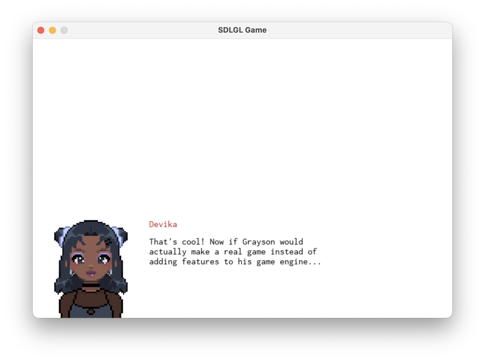

# animalese
A program to replicate the Animalese speech sound effects of the video game
Animal Crossing. It's built with SDLGL, my game custom SDL2-based game library.



## How it works

### What is animalese?

Animalese is a cartoon-ish speaking sound used in the game Animal Crossing.
Rather than using a language understandable to players, Animalese consists
of a series of high-pitched babbles that roughly correspond to the letters
and syllables being spoken.

The real Animal Crossing games use over 200 syllables to match the tones of
words being spoken, with each being approximately 150ms of audio.

### How is it implemented here?

I opted to simplify the system for easier implementation. Instead of
selecting between the 200+ original syllables based on word endings and
real pronunciation, I selected 26 syllables as a subset of the original audio,
one for each letter of the alphabet.

Sentences are shortened to only the first letter of each word, and all
non-alphabetical characters are removed.

For example, `"Hello, word!"` becomes `"h w"`.

Then, the sound corresponding to each letter of the shortened sentence is
played. Each sound is randomly pitched up or down by a small amount to add
a more dynamic speaking sound and avoid a monotonous effect.

### Audio library

In my first attempt to implement Animalese, [SDLGL](https://github.com/graysonpike/sdlgl)
used [SDL_Mixer](https://github.com/libsdl-org/SDL_mixer) as it's audio backend.
While SDL_Mixer is great for simple applications, I quickly discovered that it
was missing a few features I needed, primarily pitching of audio samples and
mixing an arbitrary number of samples.

I re-implmeneted SDLGL's audio system to use David Reid's
[miniaudio](https://github.com/mackron/miniaudio), a lightweight header-only
library for audio playback and capture. In addition to supporting pitching sounds,
it also supports 3D spatialization of audio, custom filters and effects,
a tree-based grouping system, and built-in resource management.

## Building from source

To run this program, you will need to build it from source using the
provided Makefile.

### Dependencies

Before building, you will need to build and install
[version 0.1.0](https://github.com/graysonpike/sdlgl/releases/tag/v0.1.0)
of the SDLGL game library by following the instructions in the README file.

### Building

With SDLGL installed, you can build this project using the provided Makefile:

```shell
make
```

The default target is `main.out`, the executable program.

## Usage

Run the executable `main.out` after building the project. It will read the
paragraphs specified in `paragraphs.json` and load them into the dialogue.

Pressing the **space bar** will cycle through the paragraphs.

## Development

### Additional Development Requirements
In addition to the build requirements, additional tools are required for
development. You can install them with the following commands:
#### Linux (Debian/Ubuntu)
```shell
sudo apt install clang-format
```
#### macOS
```shell
brew install clang-format
```

### Formatting
This project is auto-formatted to the Google style (modified to an indent
of 4 spaces) using the clang-format tool.

To run the auto-formatter on all files, use the following command in the
project root directory:
```shell
find . -path ./dependencies -prune -o \( -name "*.cpp" -o -name "*.h" \) -print | xargs clang-format -i
```
